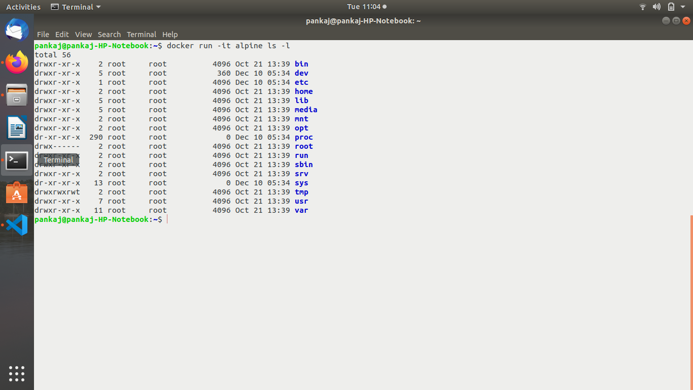
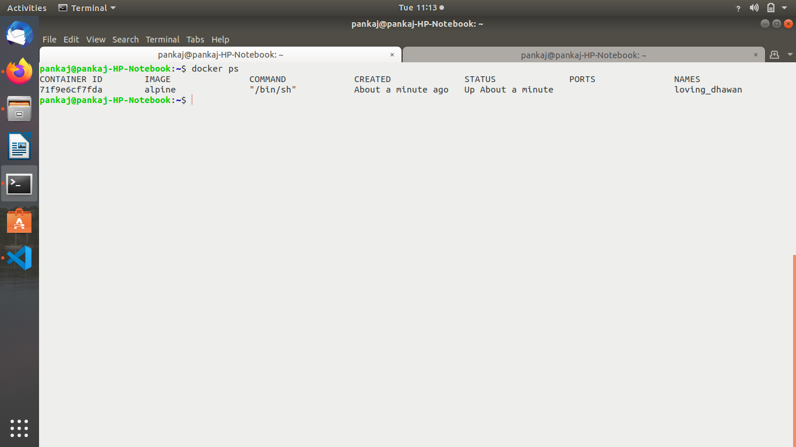
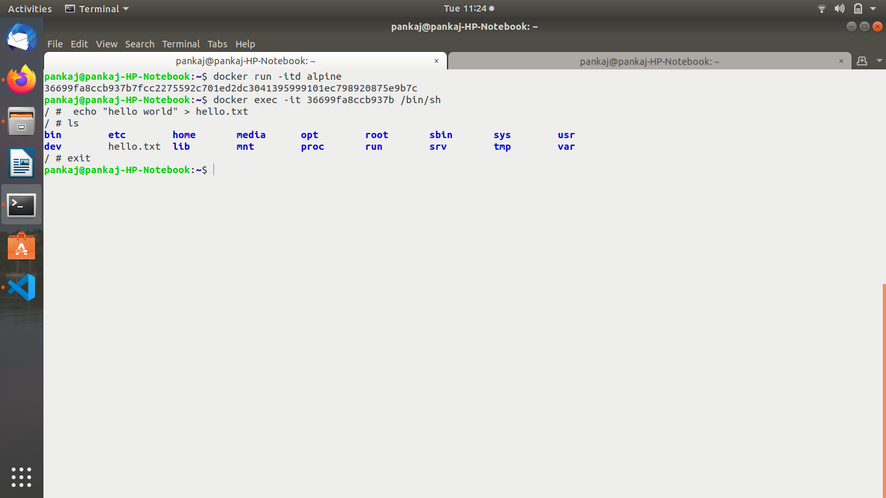

Assignment-1
--------------------------
1. Use official shell script to install and configure Docker on your control machine.

2. Start Docker service and check status of the same.

3. Enable Docker service to start at every machine reboot.

4. Display Docker version.

5. Configure non root user to run docker commands without sudo.

6. Type docker on commandline and read output i.e containing related commands.

7. Display System information using Docker.

8. Check whether you can access/download images from DockerHub or not.

Assignment-2
--------------------------

1. Run a docker container from "hello-world" image.

2. Pull "alpine" image from docker registry and see if image is available in your local image list.

3. Pull some specific version of docker "alpine" image from docker registry.

4. Run a docker container from local image "alpine" and run an inline command "ls -l" while running container.

5. Try to take login to container created using "alpine" image.

6. Detach yourself from the container without making it exit/container kill.

7. Check running containers and see if you can find out the stopped containers.

8. Stop running container.

9. Start container that was stopped earlier.

10. Try to remove "alpine" image from your local system.

Assignment-3
--------------------------

1. Again pull "alpine" image from docker registry.

2. Take interactive login to bash while running docker container from "alpine" image.

3. Run command inside container:
4. echo "hello world" > hello.txt
5. ls

6. Take exit from same container without killing the container.

7. Run another container using below command and check if you can find hello.txt within this container. You should find container isolations from step 3-5.

8. docker container run alpine ls

9. Stop a container using Container ID.

10. Start same container using ID and exec a command "echo 'hello world!'" in docker container without instantiating a new container.

11. Inspect already downloaded "alpine" docker image using docker inspect command.

12. Tag your local "alpine" image with name "myimage" along with version 1.0

