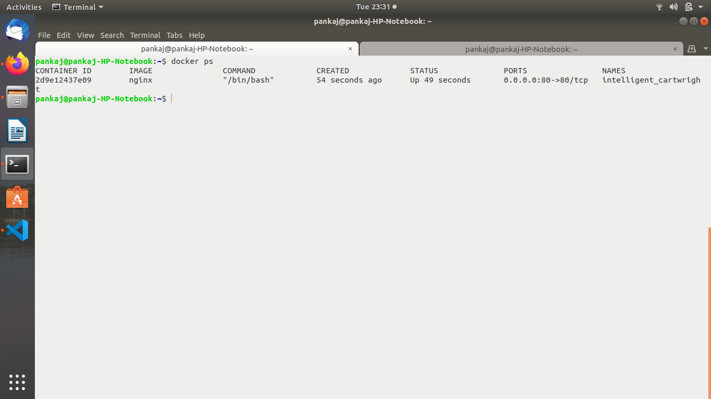

Assignment 1

Docker Port:

Pull nginx image from dockerhub.

Run a container from nginx image and map container port 80 to system port 80.

Display all mapped ports on nginx image.

Run a docker container named "containexpose" from nginx image and expose port 80 of container to outer world without mapping it to any of system port.

Docker Volume:

Create docker volume named "dbvol"

Run docker container from wordpress image and mount "dbvol" to /var/lib/mysql

Display all docker volumes.

Create another docker volume named "testvol"

Remove docker volume "testvol"

Docker Linking:

Run a container in detached mode with name "db" from image "training/postgres"

Run another container in detached mode with name "web" from image "training/webapp", link container "db" with alias "mydb" to this container and finally pass an inline command "python app.py" while running container.

Take a bash terminal in "web" container.

Test container linking by doing a ping to "mydb"

