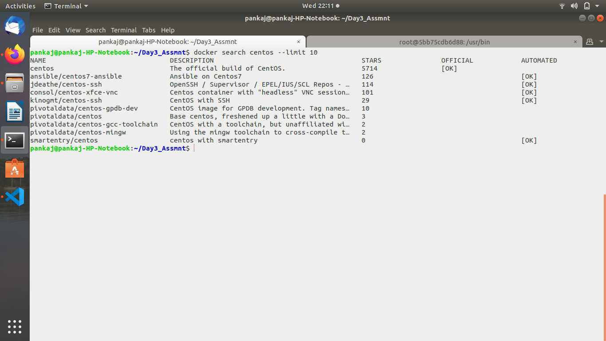
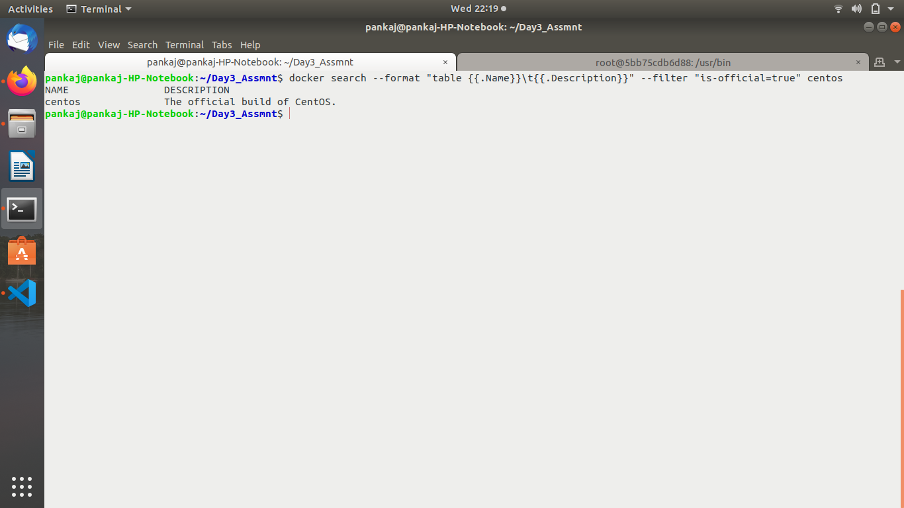

Assignment 1

Create a file named index.js with below content.


index.js
var os = require("os");
var hostname = os.hostname();
console.log("hello from " + hostname);

Create a file named Dockerfile and write code as per the steps mentioned.


Use alpine image.
Add Author/Maintainer name in DockerFile
run commands -> apk update & apk add nodejs
copy current directory to /app
change your working directory to /app
specify the default command to be run upon container creation as mentioned below.
node index.js


Build image from Dockerfile.
Tag image with name "hello:v0.1"


Assignment 2


Create a DockerFile.


Use Ubuntu latest image.


Add your name as a Manintainer.


Update local packages using command (apt-get update).


Install nodejs package.


Install npm package.


Create a symlink using command (ln -s /usr/bin/nodejs /usr/bin/node).

```
error "failed to create symbolic link '/usr/bin/node': File exists" (so commented this part in dockerfile)
```


Trigger a command (npm install -g http-server)


Add any test index.html file from local at /usr/apps/hello-docker/index.html on container.


change your working directory to /usr/apps/hello-docker/.


Run a command (http-server -s) on every container initialization.


Build your dockerfile and tag it with "yourname:docker-web"


Run a docker container from the image that you have just created and map container 8080 port to host 8080 port.(8080:8080)


Try accessing your webpage using "http://<virtualmachine_ipaddress>:8080/index.html" URL.


Delete docker container and image from local.


Assignment 3

Signup on dockerhub.


Login on dockerhub and create a repository by providing repo name "mytestrepo" and a little description about the same.


Search for "centos" image on docker using commandline.


Limit out search result to 10 entries only.



Apply a filter on search result to show entries for images having 3 stars.


Format the search result to get output containing only name,description and is_official values.



Pull an image named "centos" from dockerhub.


Tag "centos" image with name "mycentos" in your repository with version 1.1


Push that image to your repo "mytestrepo" on your dockerhub.


Do commandline logout on dockerhub.

