## Topic: Docker PORT/VOLUME/LINK

Topics to be Covered
------------------------
* Working with Docker port forwarding.
* Attaching docker volume to a container.
* Link containers.

Assignment 1
-------------------
## Docker Port:
1. Pull nginx image from dockerhub.

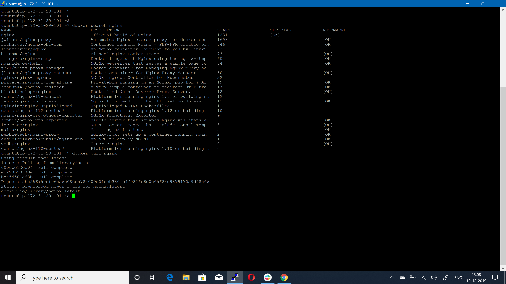

2. Run a container from nginx image and map container port 80 to system port 80.

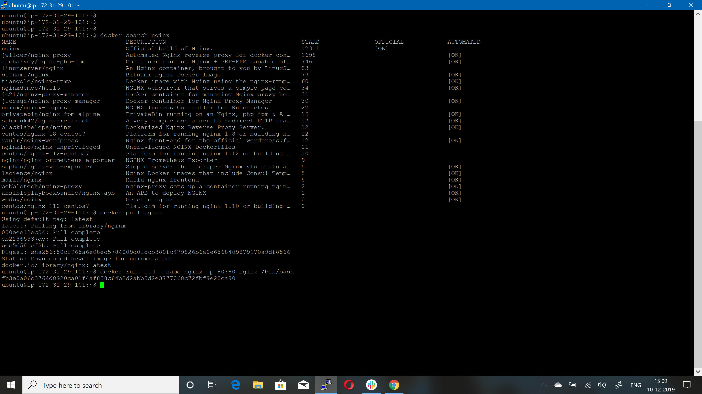

3. Display all mapped ports on nginx image.

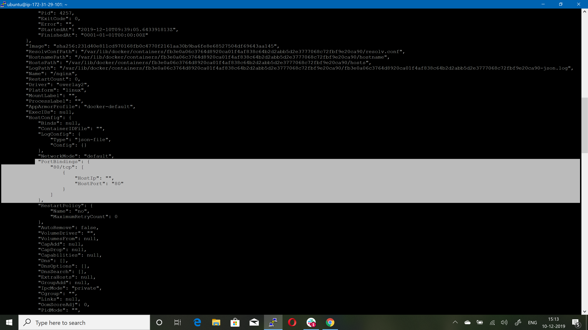

4. Run a docker container named "containexpose" from nginx image and expose port 80 of container to outer world without mapping it to any of system port.

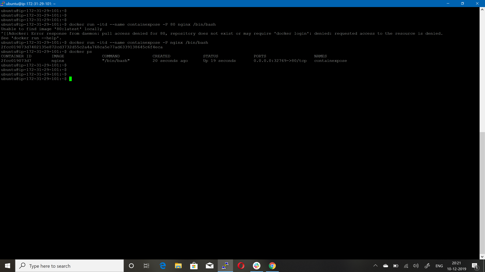

## Docker Volume:

1. Create docker volume named "dbvol"

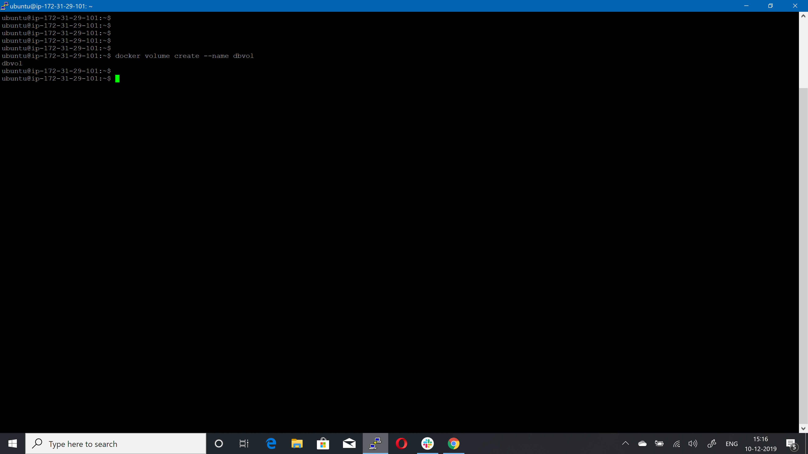

2. Run docker container from wordpress image and mount "dbvol" to /var/lib/mysql

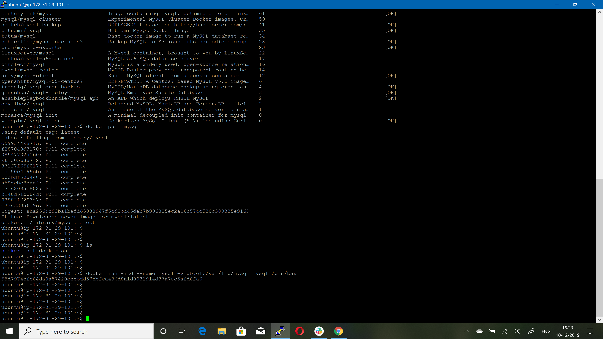

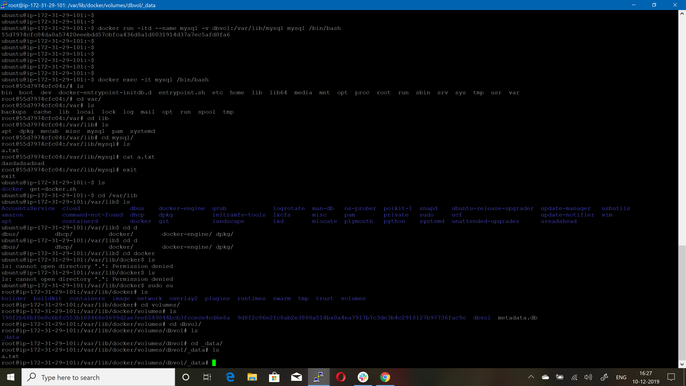

3. Display all docker volumes.

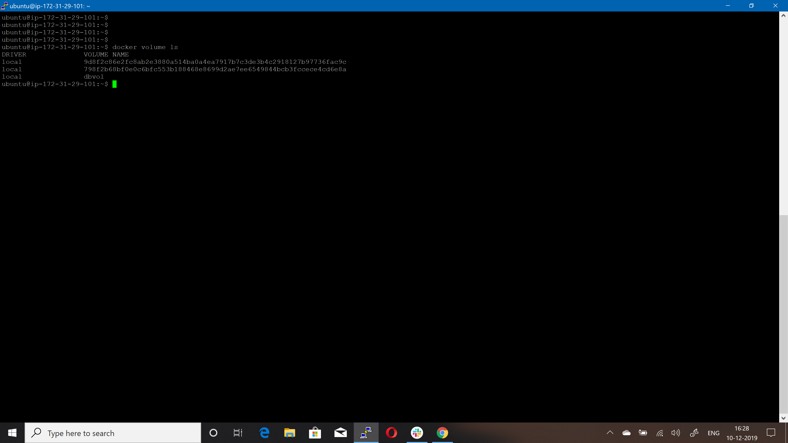

4. Create another docker volume named "testvol"

5. Remove docker volume "testvol"

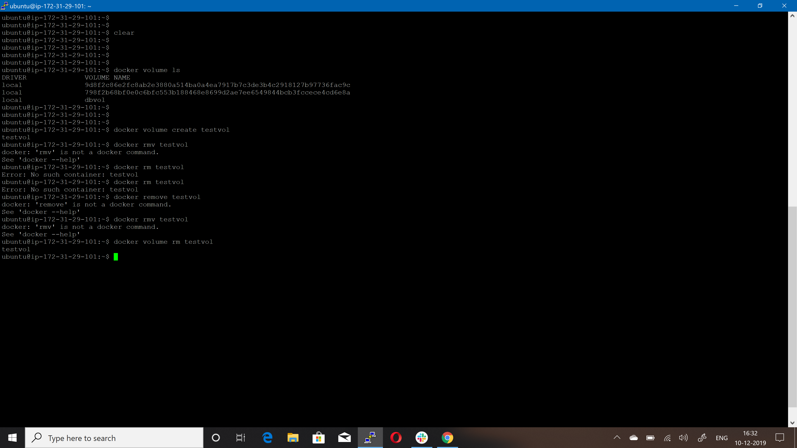

## Docker Linking:

1. Run a container in detached mode with name "db" from image "training/postgres"

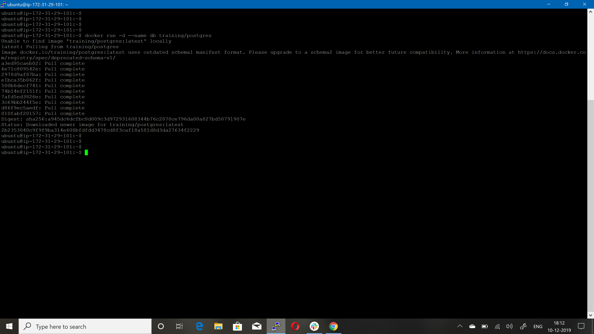

2. Run another container in detached mode with name "web" from image "training/webapp", link container "db" with alias "mydb" to this container and finally pass an inline command "python app.py" while running container.

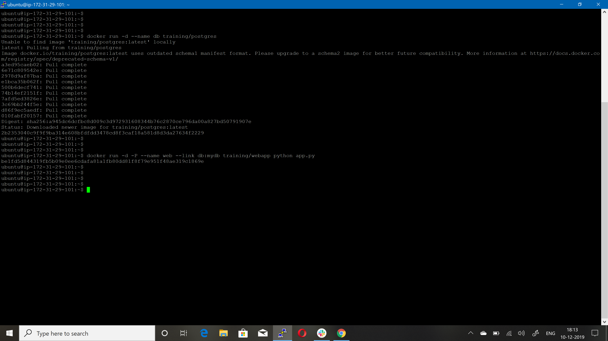

3. Take a bash terminal in "web" container.
4. Test container linking by doing a ping to "mydb"

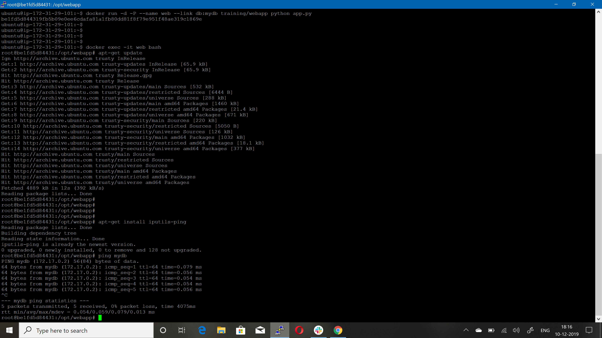

Reference
-----------------
[Docker Port/Volume/Link](https://docs.docker.com/engine/reference/commandline/run/)
