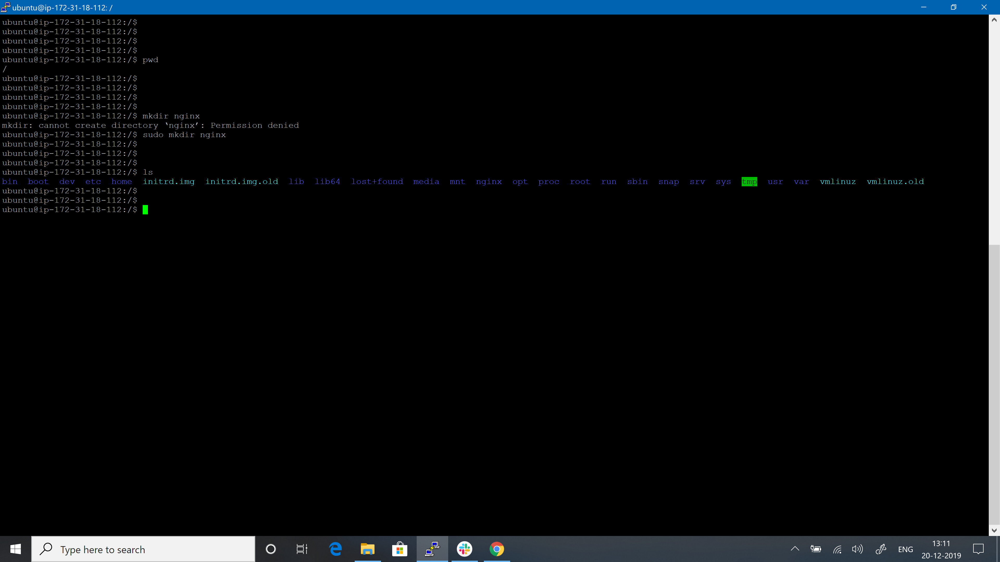

## Topic: Docker-Compose 

Topics to be Covered
------------------------
* What is Docker-Compose file.
* Why Docker-Compose.
* How Docker-compose ease the image and container creation.

Assignment:1
-------------------
* Install docker-compose on your machine, if not already installed.

* Check docker-compose version.

* Create a directory named nginx in your root.

* Switch to that directory and create a file named docker-compose.yaml
* Use docker-compose version 3 to create docker-compose.yaml file.
* Create a service named "databases".
* Use image named "mysql"
* Map container 3306 port to host machine 3306 port.
* Add environment variables named "MYSQL_ROOT_PASSWORD", "MYSQL_DATABASE", "MYSQL_USER" and "MYSQL_PASSWORD" along with corresponding values for all.
* Add another service named "web"
* Use image "nginx"

* Save docker-compose.yaml file and do docker-compose up.

* Verify nginx service is up and is accessible on machine.

* Stop and remove your docker container using docker-compose.

Assignment:2
--------------------
* Create a directory named wordpress on your local.
* switch to that directory and create a file named docker-compose.yaml
* Use docker-compose version 3 to create docker-compose.yaml file.
* Create a service named "wordpress" using wordpress:latest image.
* Map port of wordpress container port 80 to host system port 8000.
* Add a parameter to restart container in case service went down.
* Within wordpress environment variable, add wordpress_db_host value along with port.
* Also add one more variable named wordpress_db_password.
* Add a volume named wordpress_data.

*Add one more service named "db" under same docker-compose file.
* Use image named mysql with version 5.7
* Use volume wordpress_data and map it to /var/lib/mysql
* Enable always restart parameter.
* Add environment variables named "MYSQL_ROOT_PASSWORD", "MYSQL_DATABASE", "MYSQL_USER" and "MYSQL_PASSWORD" along with corresponding values for all.

* At last add a dependency of db service in wordpress service.
* save the file and build docker-compose.yaml and create containers for wordpress and db machine.
* Display currently bulit containers created using docker-compose.
* Stop and remove your docker container using docker-compose.

Reference
-----------------
[Docker-Compose](https://docs.docker.com/compose/overview/)
