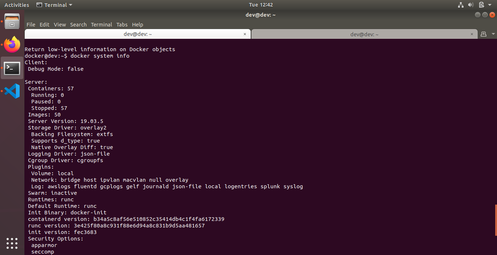
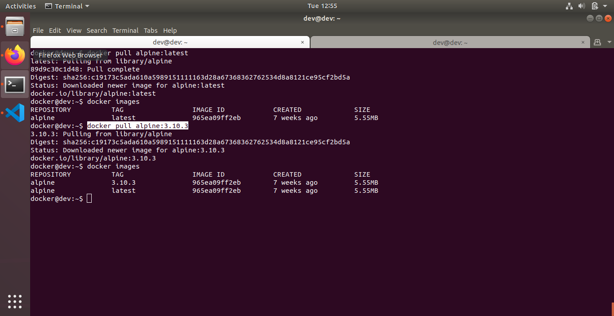

## Topic: Docker Installation on Centos 7

Topics to be Covered
-------------------------
* Installing Docker using yum or apt.
* Installing Docker Automatically using official shell script.
* Docker Architecture
* Docker Engine
* Docker Daemon
* Docker Client

What You Will Learn
----------------------------
How easy it is to install and configure Docker for yourself.
How docker client communicated with Docker daemon.


Assignment-1
--------------------------
1. Use official shell script to install and configure Docker on your control machine.

    ```https://get.docker.com/```

2. Start Docker service and check status of the same.

``` sudo systemctl start docker  && sudo systemctl status docker```


3. Enable Docker service to start at every machine reboot.

```sudo systemctl enable docker```


4. Display Docker version.

``` docker version ```


5. Configure non root user to run docker commands without sudo.
 
 follow below steps
 * sudo groupadd docker (If there is no group present named docker)
 * sudo usermod -aG docker $USER 

 These steps will fulfill the requirement

6. Type docker on commandline and read output i.e containing related commands.


7. Display System information using Docker.

```docker system info```


8. Check whether you can access/download images from DockerHub or not.

``` docker pull imagename ```


Assignment-2
--------------------------

1. Run a docker container from "hello-world" image.

```docker run -it fce289e99eb9 ```


2. Pull "alpine" image from docker registry and see if image is available in your local image list.
 
 ``` docker pull alpine:latest ```
 

``` docker images```


3. Pull some specific version of docker "alpine" image from docker registry.

```docker pull alpine:3.10.3```



4. Run a docker container from local image "alpine" and run an inline command "ls -l" while running container.

```  docker run -it  alpine  ls -l```


5. Try to take login to container created using "alpine" image.

``` docker run -it alpine /bin/sh ```


6. Detach yourself from the container without making it exit/container kill.

``` docker run -itd alpine /bin/sh ``` 
                &
``` docker ps ```


                


7. Check running containers and see if you can find out the stopped containers.


``` docker ps -a ```


8. Stop running container.

``` docker stop fe90bc71a0b3 ```


9. Start container that was stopped earlier.

``` docker start fe90bc71a0b3 ```


10. Try to remove "alpine" image from your local system.

``` docker rmi alpine:latest```

Assignment-3
--------------------------

1. Again pull "alpine" image from docker registry.

``` docker pull alpine:latest```

2. Take interactive login to bash while running docker container from "alpine" image.

``` docker run -it alpine /bin/sh ```


3. Run command inside container:

 

4. echo "hello world" > hello.txt


5. ls

 

6. Take exit from same container without killing the container.

``` docker exec -it alpine /bin/bash ```


7. Run another container using below command and check if you can find hello.txt within this container. You should find container isolations from step 3-5.
8. docker container run alpine ls
``` NO hello.txt inside the container ```


9. Stop a container using Container ID.

```docker stop 8e78c9c74b51```

10. Start same container using ID and exec a command "echo 'hello world!'" in docker container without instantiating a new container.

```docker start  8e78c9c74b51```
```docker exec -it 8e78c9c74b51 /bin/sh```

11. Inspect already downloaded "alpine" docker image using docker inspect command.


12. Tag your local "alpine" image with name "myimage" along with version 1.0
```docker tag  alpine myimage:1.0.1```


Reference
----------------
[Docker Installation](https://www.digitalocean.com/community/tutorials/how-to-install-and-use-docker-on-centos-7)

[Docker Cli](https://docs.docker.com/engine/reference/run/) 