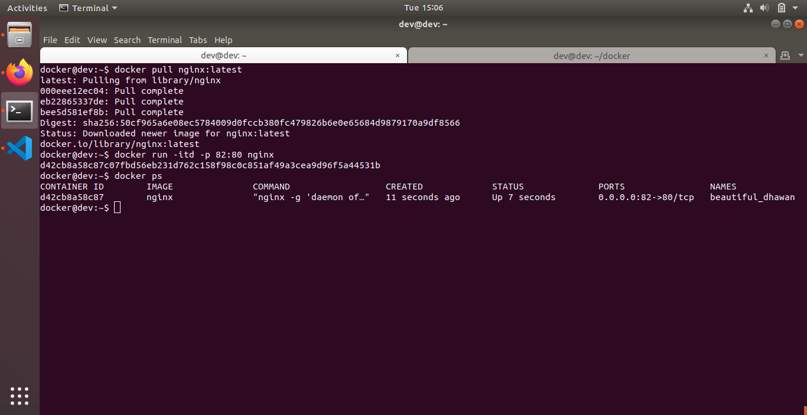
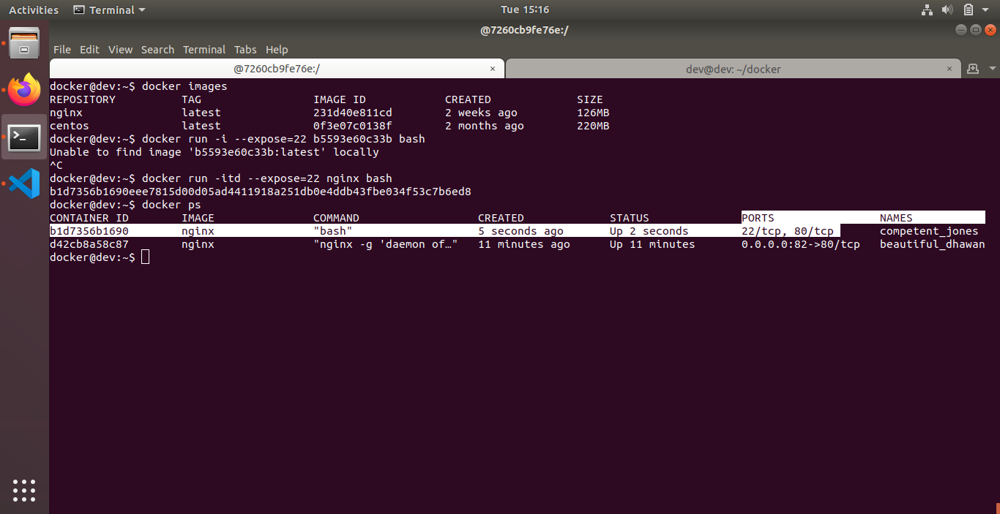
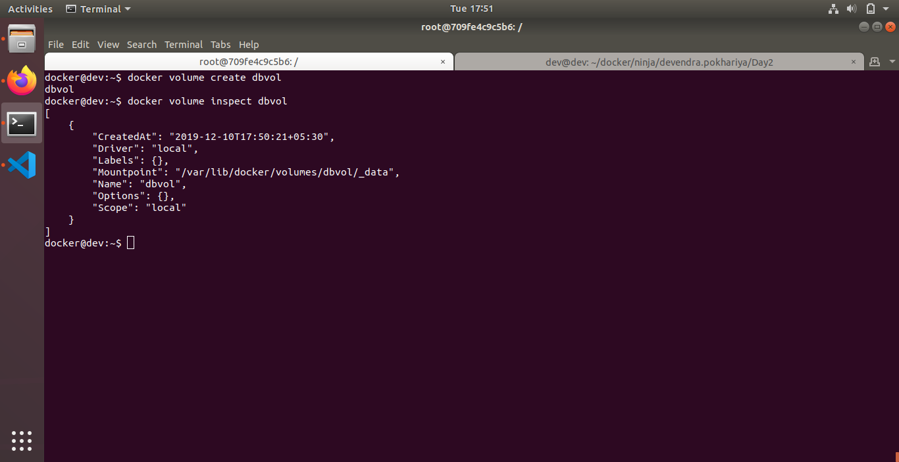
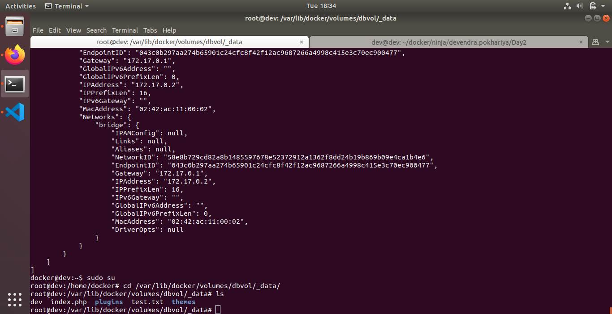
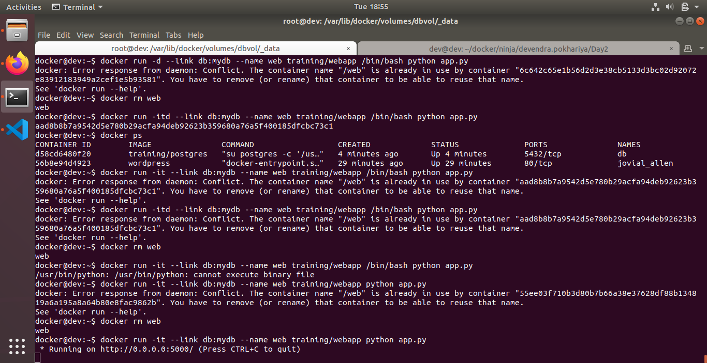
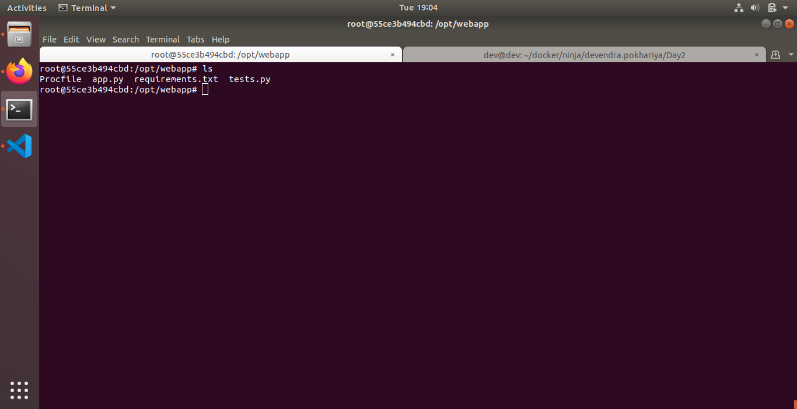
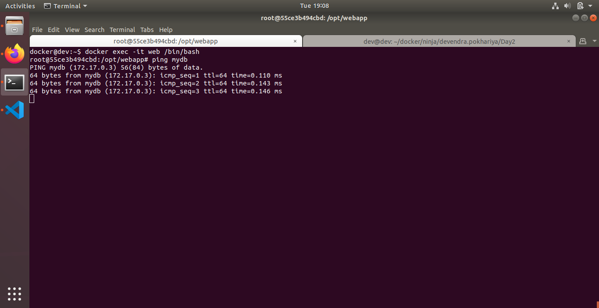

## Topic: Docker PORT/VOLUME/LINK

Topics to be Covered
------------------------
* Working with Docker port forwarding.
* Attaching docker volume to a container.
* Link containers.

Assignment 1
-------------------
## Docker Port:
1. Pull nginx image from dockerhub.

```docker pull nginx:latest```

2. Run a container from nginx image and map container port 80 to system port 82.

``` docker run -itd -p 82:80 nginx ```


3. Display all mapped ports on nginx image.



4. Run a docker container named "containexpose" from nginx image and expose port 80 of container to outer world without mapping it to any of system port.

``` docker run -itd --expose=22 nginx bash```


## Docker Volume:
1. Create docker volume named "dbvol"

``` docker volume create dbvol```
``` docker volume inspect dbvol```



2. Run docker container from wordpress image and mount "dbvol" to /usr/src/wordpress/wp-content

``` docker run -itd -v  dbvol:/usr/src/wordpress/wp-content wordpress ```

3. Display all docker volumes.

``` docker volume ls```




4. Create another docker volume named "testvol"

``` docker volume create testvol``

5. Remove docker volume "testvol"

``` docker volume rm testvol ```


## Docker Linking:
1. Run a container in detached mode with name "db" from image "training/postgres"
``` docker pull training/postgres```
``` docker run -d training/postgres ```


2. Run another container in detached mode with name "web" from image "training/webapp", link container "db" with alias "mydb" to this container and finally pass an inline command "python app.py" while running container.

``` docker run -it --link db:mydb --name web training/webapp python app.py ```



3. Take a bash terminal in "web" container.

```docker run -itd --link db:mydb --name web training/webapp python app.py```
```docker exec -it web /bin/bash```



4. Test container linking by doing a ping to "mydb"



Reference
-----------------
[Docker Port/Volume/Link](https://docs.docker.com/engine/reference/commandline/run/)
