## Topic: Docker DOCKERFILE
## Topic: DockerHub/Registry


Topics to be Covered
------------------------
* What is DockerFile.
* How DockerFile is easing the things that we were doing using Docker CLI.
* What is DockerHub and application of docker hub.
* How to use DockerHub to push and pull images..


Assignment 1
-------------------
1. Create a file named index.js with below content.

index.js
----------------
var os = require("os");
var hostname = os.hostname();
console.log("hello from " + hostname);

2. Create a file named Dockerfile and write code as per the steps mentioned.

* Use alpine image.
* Add Author/Maintainer name in DockerFile
* run commands -> apk update & apk add nodejs
* copy current directory to /app
* change your working directory to /app
* specify the default command to be run upon container creation as mentioned below.
	node index.js
	
3. Build image from Dockerfile.
4. Tag image with name "hello:v0.1"

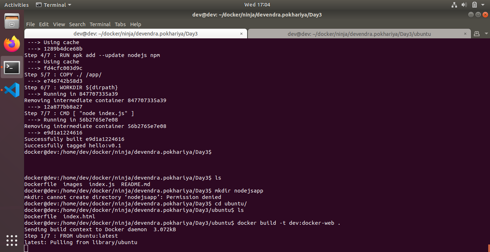

Assignment 2
-----------------------
1. Create a DockerFile.
2. Use Ubuntu latest image.
3. Add your name as a Manintainer.
4. Update local packages using command (apt-get update).
5. Install nodejs package.
6. Install npm package.
7. Create a symlink using command (ln -s /usr/bin/nodejs /usr/bin/node).
8. Trigger a command (npm install -g http-server)
9. Add any test index.html file from local at /usr/apps/hello-docker/index.html on container.
10. change your working directory to /usr/apps/hello-docker/.
11. Run a command (http-server -s) on every container initialization.
12. Build your dockerfile and tag it with "yourname:docker-web"

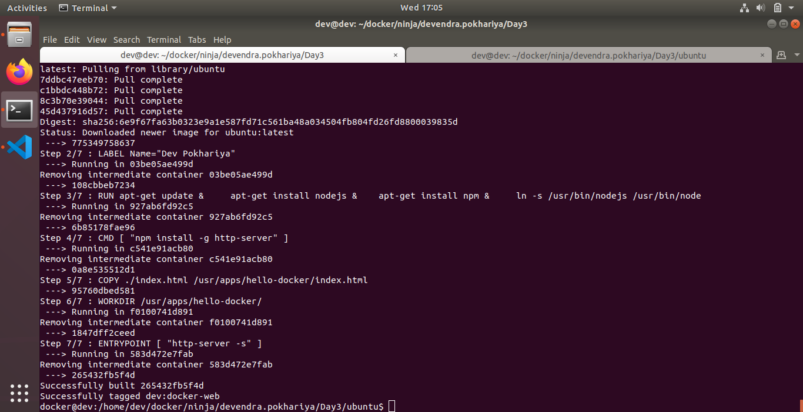

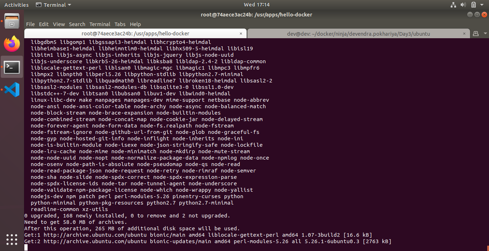

13. Run a docker container from the image that you have just created and map container 8080 port to host 8080 port.(8080:8080)

```docker run -itdp 8085:8080 dev:docker-web```

14. Try accessing your webpage using "http://<virtualmachine_ipaddress>:8080/index.html" URL.


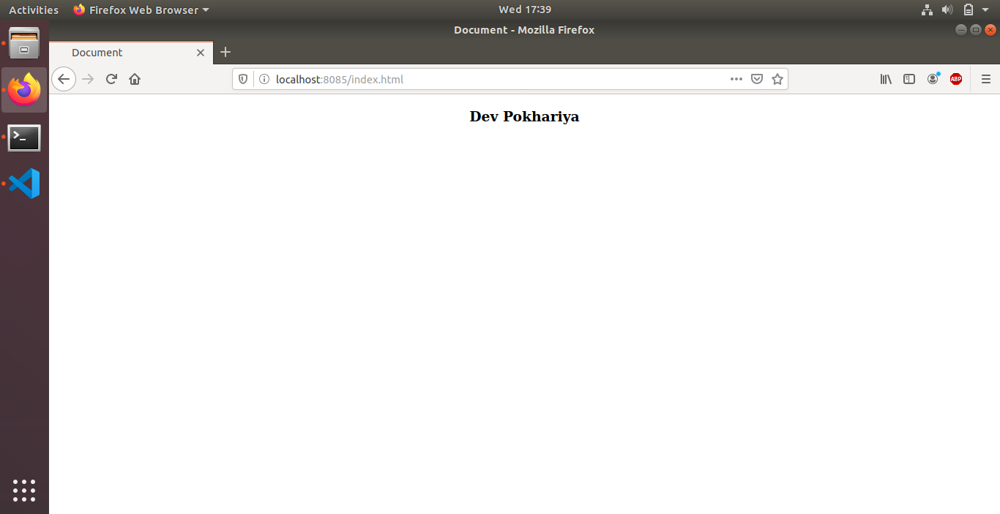

15. Delete docker container and image from local.
``` docker stop 020c73ba1fab```
``` docker rm 020c73ba1fab```
``` docker rmi dev:docker-web```

Assignment 3
------------------------

1.  Signup on dockerhub.
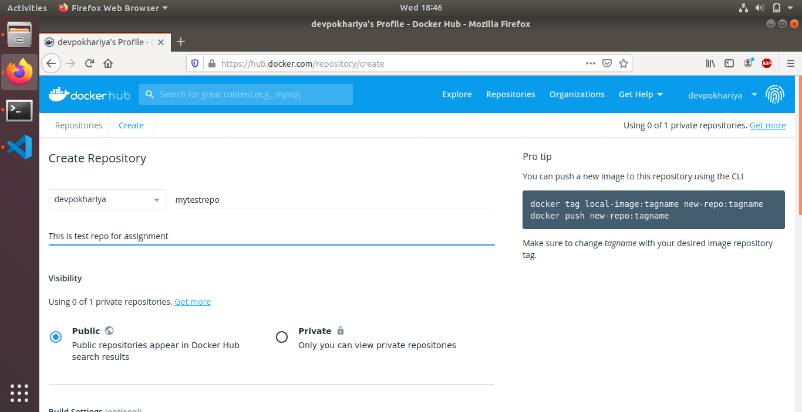
2.  Login on dockerhub and create a repository by providing repo name "mytestrepo" and a little description about the same.
```docker login --username devpokhariya```


3.  Search for "centos" image on docker using commandline.

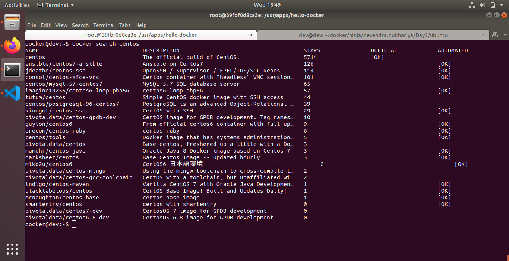

4.  Limit out search result to 10 entries only.

```docker search centos --limit 10```
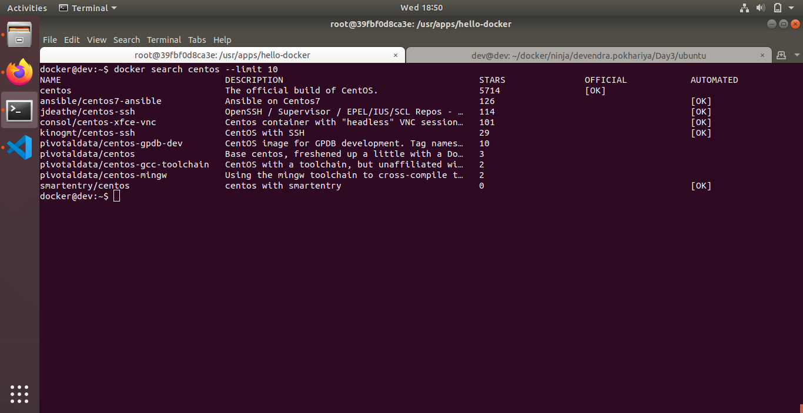

5.  Apply a filter on search result to show entries for images having 3 stars.

```docker search centos --filter STARS=3```
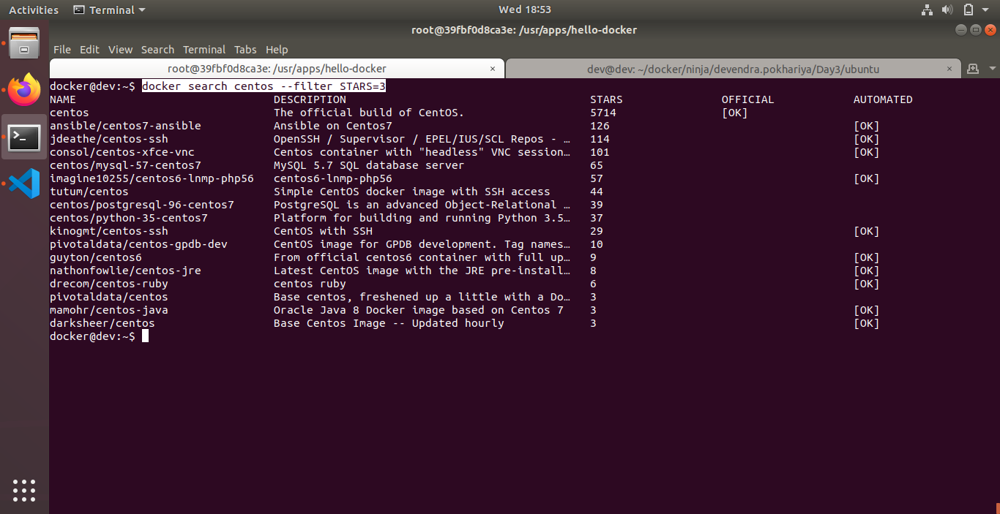

6.  Format the search result to get output containing only name,description and is_official values.

```docker search --format "table {{.Name}}\t{{.Description}}" --filter "is-official=true" centos```
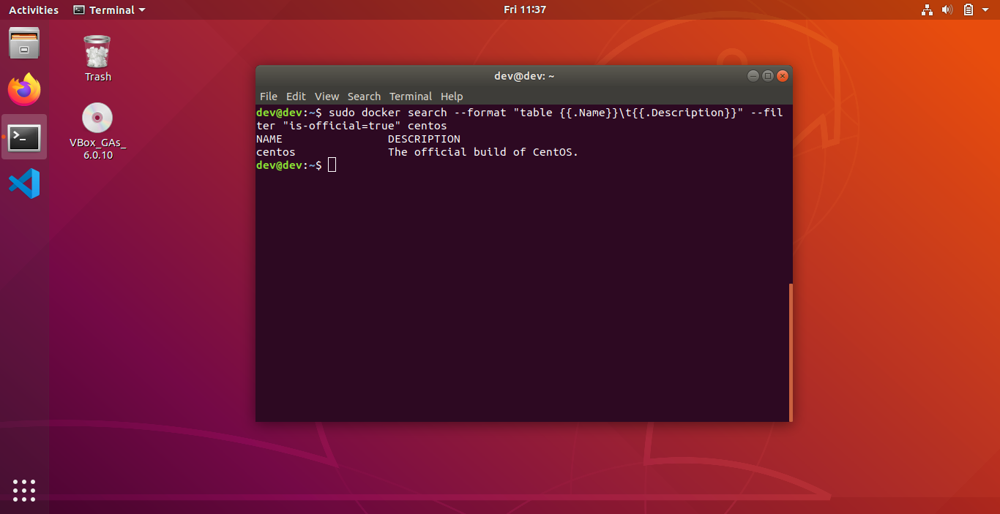


7.  Pull an image named "centos" from dockerhub.

``` docker pull centos::latest```
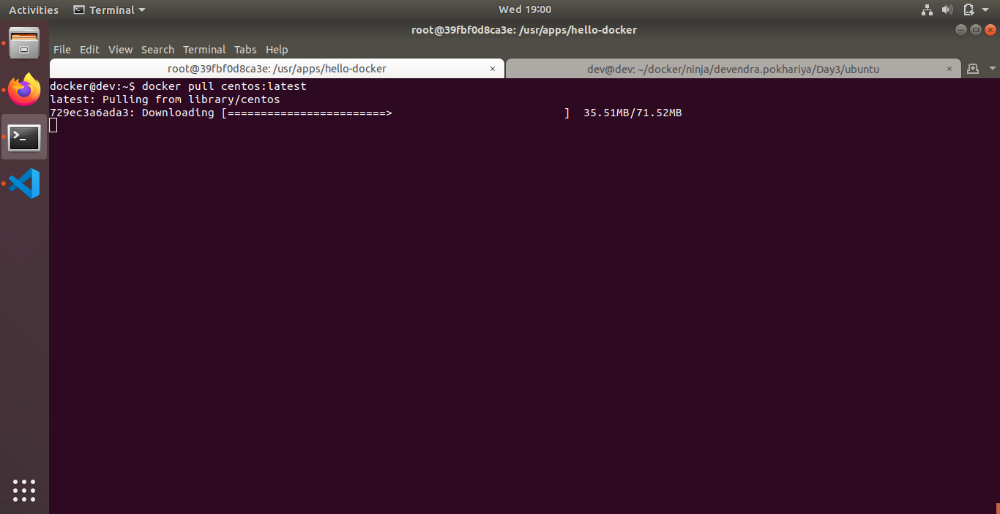

8.  Tag "centos" image with name "mycentos" in your repository with version 1.1

``` docker tag centos mycentos```
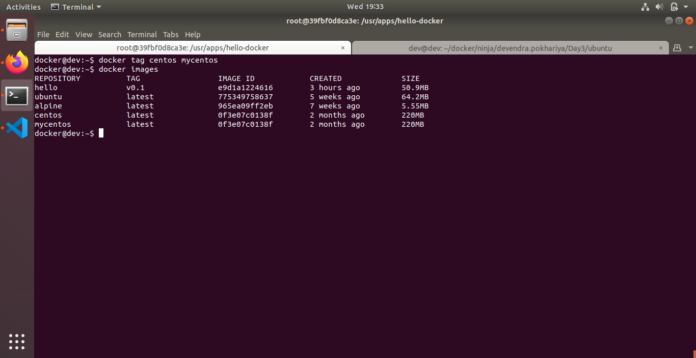


9.  Push that image to your repo "mytestrepo" on your dockerhub.

```docker tag centos devpokhariya/mycentos```

```docker push  devpokhariya/mycentos:latest```

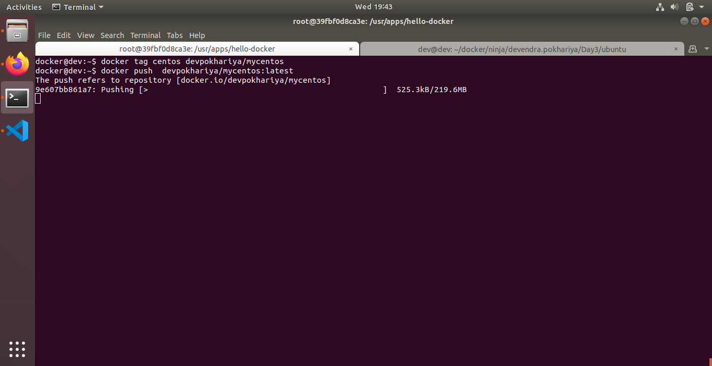

* Finally pushed

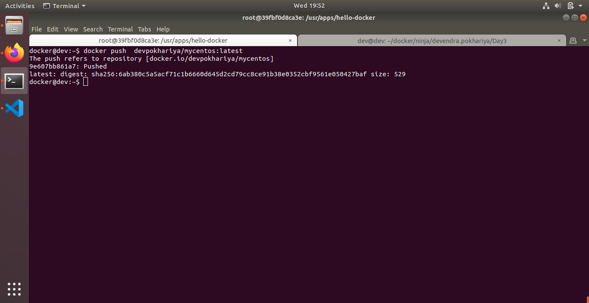

* Repositry
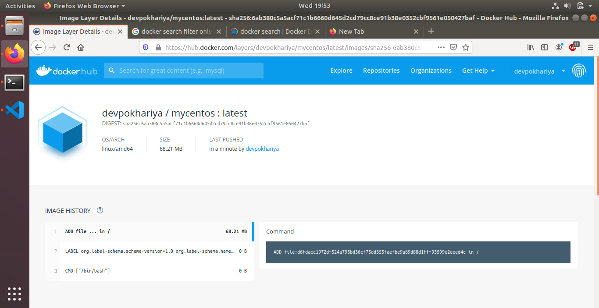

10. Do commandline logout on dockerhub.
``` docker logout```

Reference
-----------------
[Docker DockerFile](https://docs.docker.com/engine/reference/builder/)
[DockerHub/Registry](https://docs.docker.com/develop/develop-images/image_management/)

