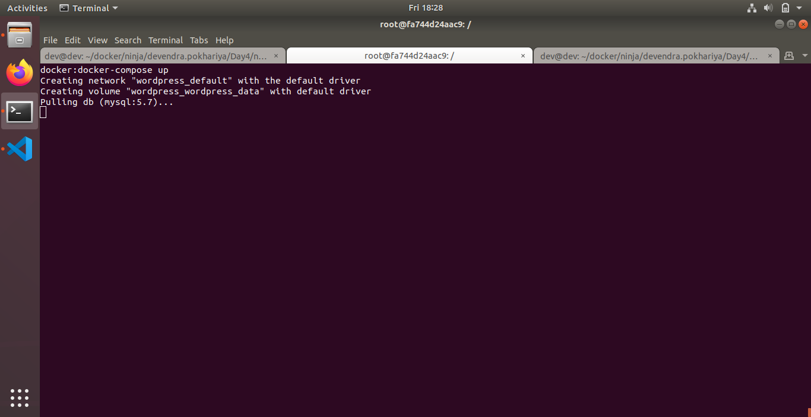

## Topic: Docker-Compose 

Topics to be Covered
------------------------
* What is Docker-Compose file.
* Why Docker-Compose.
* How Docker-compose ease the image and container creation.

Assignment:1
-------------------
* Install docker-compose on your machine, if not already installed.

``` sudo apt install -y docker-compose ```

* Check docker-compose version.

```docker-compose -v```


* Create a directory named nginx in your root.

```mkdir nginx```

* Switch to that directory and create a file named docker-compose.yaml

``` cd nginx && vim docker-compose.yaml```

* Use docker-compose version 3 to create docker-compose.yaml file.

* Create a service named "databases".

* Use image named "mysql"
* Map container 3306 port to host machine 3306 port.
* Add environment variables named "MYSQL_ROOT_PASSWORD", "MYSQL_DATABASE", "MYSQL_USER" and "MYSQL_PASSWORD" along with corresponding values for all.

* Add another service named "web"
* Use image "nginx"
* Save docker-compose.yaml file and do docker-compose up.


```

    version: '3'
    services:
      databases:
        image: mysql
        ports:
          - "3306:3306"
        environment:
          - MYSQL_ROOT_PASSWORD=xyz
          - MYSQL_DATABASE=xyz
          - MYSQL_USER=xyz
          - MYSQL_PASSWORD=xyz
      web:
        image: nginx
        ports:
          - "85:80"


 ```

* Verify nginx service is up and is accessible on machine.

 

* Stop and remove your docker container using docker-compose.

``` docker-compose stop && docker-compose down ```


Assignment:2
--------------------
* Create a directory named wordpress on your local.
``` mkdir wordpress```

* switch to that directory and create a file named docker-compose.yaml

* Use docker-compose version 3 to create docker-compose.yaml file
* Create a service named "wordpress" using wordpress:latest image.


* Map port of wordpress container port 80 to host system port 8000.
* Add a parameter to restart container in case service went down.
* Within wordpress environment variable, add wordpress_db_host value along with port.
* Also add one more variable named wordpress_db_password.
* Add a volume named wordpress_data.

*Add one more service named "db" under same docker-compose file.
* Use image named    with version 5.7
* Use volume wordpress_data and map it to /var/lib/mysql
* Enable always restart parameter.
* Add environment variables named "MYSQL_ROOT_PASSWORD", "MYSQL_DATABASE", "MYSQL_USER" and "MYSQL_PASSWORD" along with corresponding values for all.

* At last add a dependency of db service in wordpress service.
* save the file and build docker-compose.yaml and create containers for wordpress and db machine.

- Please check the wordpress/docker-compose.yaml
```docker-compose up```



* Display currently bulit containers created using docker-compose.

```docker-compose ps```


- Check if wordpress container is running successfully

``` localhost:8000 OR containerip:8000```


- Add Database name and port and you have declared in your compose file and run installtion 


- Now set the username and password of your wordpress website


- Login in your wordpress site to check if the database connects successfully


- Your login dashboard


- Your website Up and live

* Stop and remove your docker container using docker-compose.
```docker-compose stop```

```docker-compose down```


Reference
-----------------
[Docker-Compose](https://docs.docker.com/compose/overview/)
